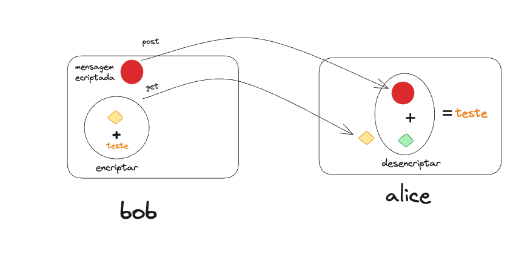

# Documentação do Código - Bob API e Alice API

Este repositório contém código para duas APIs, "bob-api" e "alice-api", que ilustram um cenário de comunicação segura usando criptografia RSA de chave pública/privada. Neste cenário, Bob (bob-api) deseja enviar uma mensagem segura para Alice (alice-api) de forma que apenas Alice possa descriptografá-la.

## Algoritmo de Criptografia - RSA

O RSA (Rivest-Shamir-Adleman) é um dos algoritmos de criptografia de chave pública mais amplamente utilizados e é amplamente empregado para garantir a confidencialidade e a autenticidade das informações em sistemas de segurança de dados.

## Bob API

A API Bob é responsável por enviar uma mensagem segura para Alice. Aqui estão os principais componentes e como eles funcionam:

### Rota `/message` (POST)

Quando uma solicitação POST é feita para esta rota, a API gera uma mensagem simples: "Hello World!".

Em seguida, ela faz uma solicitação HTTP para a API Alice (`http://localhost:3333/alice-key`) para obter a chave pública de Alice. Isso é feito usando a biblioteca Axios.

A mensagem é criptografada usando a chave pública de Alice com o algoritmo RSA e o padding RSA_PKCS1_OAEP_PADDING.

A mensagem criptografada é convertida em uma representação de string base64 para ser transmitida com segurança.

Finalmente, a mensagem criptografada é enviada para a API Alice (`http://localhost:3333/alice-message`) usando outra solicitação POST e a resposta é retornada ao remetente original.

## Alice API

A API Alice é responsável por receber mensagens criptografadas e descriptografá-las.

### Geração de Chaves

-Quando a API Alice é iniciada, ela gera um par de chaves RSA (chave pública e chave privada) usando `crypto.generateKeyPairSync`.

A chave pública é disponibilizada para outras partes por meio da rota `/alice-key`.

### Rota `/alice-key` (GET)

Quando uma solicitação GET é feita para esta rota, a API retorna a chave pública de Alice em formato PEM.

### Rota `/alice-message` (POST)

Quando uma solicitação POST é feita para esta rota, a API recebe uma mensagem criptografada no formato base64.

A mensagem é descriptografada usando a chave privada de Alice com o algoritmo RSA e o padding RSA_PKCS1_OAEP_PADDING.

A mensagem descriptografada é retornada como resposta.

## Configuração e Uso

Ter o Node.js instalado.

Para executar cada API, seguintes comandos:

```shell
# Executar a API Bob na porta 3333
cd bob-api
npm install
npm run dev

# Executar a API Alice na porta 3334
cd alice-api
npm install
npm run dev
```
